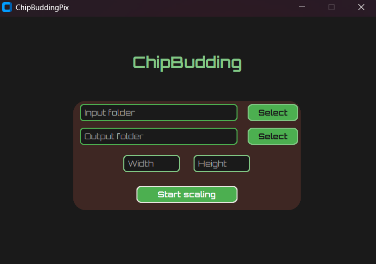
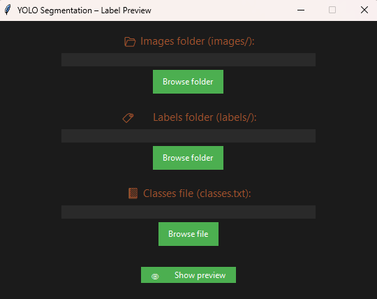
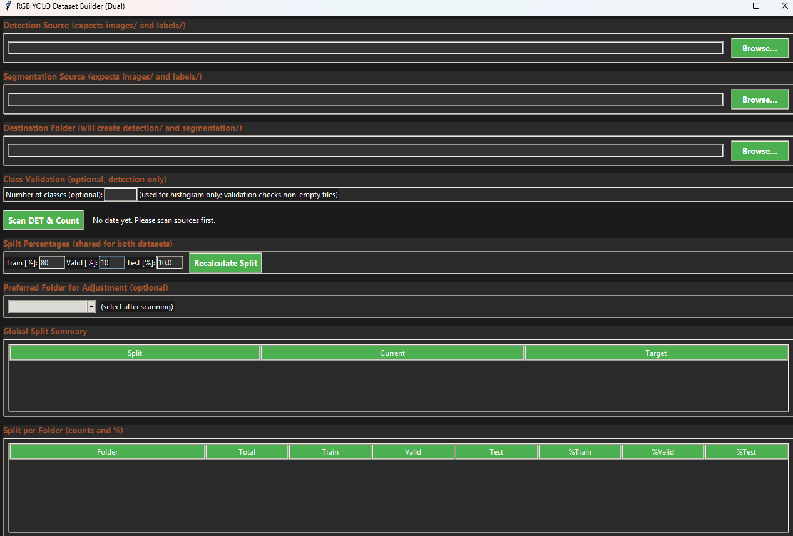
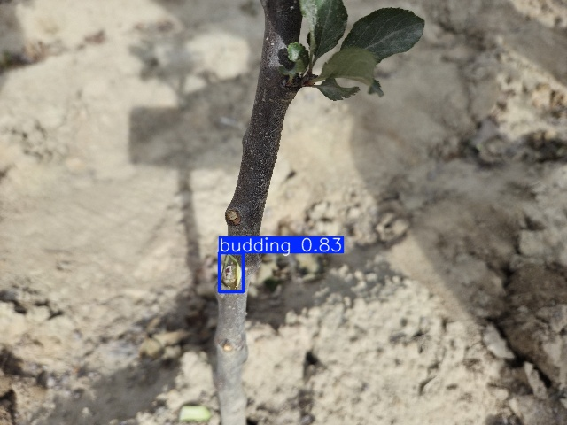
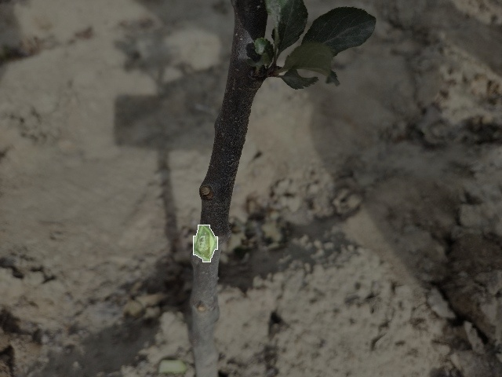

  

 This repository contains all preprocessing, training, and evaluation scripts used in the study “Detection and segmentation of Chip Budding Graft Sites in Apple Nursery Using YOLO Models”. The project evaluates YOLOv8s, YOLOv9s, YOLOv10s YOLO11s, YOLO12s, YOLOv8s-seg and YOLO11s-seg models for the detection and segmentation of Chip Budding Graft Sites in Apple Nursery using RGB imagery acquired with a Samsung Galaxy S25.

## Citation
If you use this repository, please cite:
--It will be available after publication--

### `01_ImageScaling.py`
Graphical preprocessing tool implementing batch image resizing via OpenCV. Features an interactive `customtkinter` interface for selecting input/output directories and specifying target dimensions. Supports standard image formats (`.jpg`, `.jpeg`, `.png`, `.bmp`, `.tiff`) with automatic folder management and preserved filenames. Used for dataset normalization and resolution unification in computer vision and machine learning pipelines.

  

### `02_JSONtoTXT.py`
Annotation conversion utility for transforming VIA (VGG Image Annotator) JSON files into YOLO-compatible `.txt` label format. Supports both VIA 2.x and 3.x project structures, automatically parsing region and shape attributes across multiple annotation files. Implements automatic image-path resolution and bounding-box extraction for diverse region types (rectangles, polygons, circles, ellipses). Provides a `tkinter`-based GUI for selecting JSON sources, image directories, and output destinations, ensuring one label file per image. Used to streamline dataset preparation and unify annotation formats for object detection experiments.

### `03_SegmentationViewer.py`
Interactive visualization tool for inspecting YOLO-style segmentation annotations. Uses OpenCV for real-time rendering of polygonal masks and class overlays with random color assignment per class. Integrates a simple `tkinter` interface for selecting image, label, and class-definition paths, enabling sequential image navigation. Displays filled and outlined segmentation polygons with class labels, supporting quick qualitative validation of dataset annotations.

  

### `04_DataSetsOrganizer.py`
Comprehensive dataset management utility for building synchronized YOLO detection and segmentation datasets from raw sources. Implements dual-mode organization with identical train/validation/test splits and automatic folder structure generation. Performs validation of image–label pairs, generates CSV reports for missing or invalid files, and produces per-split statistics. Includes a dark-themed `tkinter` GUI for directory selection, class histogram visualization, and controlled data distribution across subsets. Used to standardize and replicate dataset preparation workflows for joint detection–segmentation experiments.

  

### `05_Training.py`
Training script for YOLO-based object detection using the Ultralytics framework.  Performs environment verification for Python, PyTorch, CUDA, cuDNN, and JupyterLab versions to ensure reproducible training conditions. Generates a structured YOLO-compatible dataset configuration (`data.yaml`) and validates directory integrity before training. Executes model initialization and training with configurable hyperparameters (optimizer, learning rate, batch size, momentum) on GPU-enabled systems. Designed for automated reproducible experimentation and performance benchmarking of YOLO-based models.

### `06_ModelDETECTION_evaluation_using_test_set.py`
Evaluation and inference script for assessing YOLO-based object detection models on the TEST set. Performs GPU-accelerated validation with automatic metric computation (Precision, Recall, F1, mAP@0.5, mAP@[.5:.95]) using the Ultralytics API. Parses dataset configuration from `data.yaml`, verifies TEST set integrity, and saves numerical results to `metrics_summary_testset.csv`. Executes full prediction over the TEST set, exporting visualized detections and a comprehensive JSON file with bounding-box coordinates, confidences, and class IDs. Designed for standardized post-training model validation and reproducible benchmark comparison across experimental runs.

  

### `07_ModelSEGMENTATION_evaluation_using_test_set.py`
Evaluation and visualization script for YOLO-based instance segmentation models on the TEST set. Performs CUDA-accelerated validation and computes segmentation-specific metrics (Precision, Recall, F1, mAP@0.5, mAP@[.5:.95]) using the Ultralytics API. Parses dataset configuration from `data.yaml`, validates TEST set integrity, and saves numerical summaries to `metrics_summary_testset.csv`. Executes inference on the TEST set, exporting results as a structured JSON file containing bounding boxes, class IDs, confidences, and binary mask data. Generates semi-transparent colored overlays and per-instance binary masks for qualitative visualization, enabling detailed segmentation performance assessment.

  

### `08_RTX_5080-performance_TORCH.py`
High-performance benchmarking suite for YOLO detection and segmentation models using CUDA acceleration on RTX-class GPUs. Performs multi-model evaluation sessions with warmup, cooldown, and FP16 inference to measure throughput (FPS), latency, and jitter stability. Implements automatic GPU stabilization, precision timing, and outlier trimming to ensure reliable and reproducible measurements. Generates per-session and global benchmark reports in `.xlsx` format, summarizing statistical performance metrics across all tested models. Designed for laboratory-grade inference benchmarking, comparative efficiency analysis, and GPU performance profiling in PyTorch environments.

### `09_Torch_TO_Tensor.py`
Automated TensorRT export utility for YOLO models trained in PyTorch. Recursively scans directories for `.pt` weight files, performs FP16-optimized conversion to `.engine` format, and organizes outputs by model type. Leverages the Ultralytics export API with configurable workspace, static input resolution, and optional layer simplification for deployment efficiency. Used to generate TensorRT-accelerated inference engines optimized for NVIDIA GPUs, enabling high-throughput, low-latency execution in production pipelines.

### `10_Jetson_Orin_NX-performance_TENSOR.py`
Benchmarking framework for TensorRT-optimized YOLO models executed on NVIDIA Jetson Orin NX devices. Implements FP16 inference benchmarking with controlled GPU stabilization, warmup and measurement phases, and percentile-based outlier trimming. Measures per-model performance in FPS, latency, and jitter, repeating tests across multiple runs for statistical reliability. Generates per-session and global `.xlsx` reports summarizing timing metrics and efficiency ratios (mAP/FPS) for detection and segmentation engines. Designed for embedded GPU performance profiling and reproducible inference benchmarking under laboratory conditions.

### `11_Torch_and_Tensor_PERFORMANCE_Analysis_Mean_Standard_Deviation.py`
Statistical post-processing tool for analyzing YOLO benchmark results from Torch and TensorRT performance sessions. Loads `.xlsx` benchmark outputs, safely converts numerical columns, removes invalid entries, and computes per-model summary statistics. Calculates mean, standard deviation, median, and coefficient of variation (CV%) for FPS, latency, and efficiency metrics (mAP/FPS). Outputs a consolidated report (`FINAL_RTX_STATISTICS_FIX.xlsx`) for comparative performance analysis between frameworks and hardware configurations. Designed to support quantitative benchmarking, reproducibility assessment, and result visualization in deep learning performance studies.

